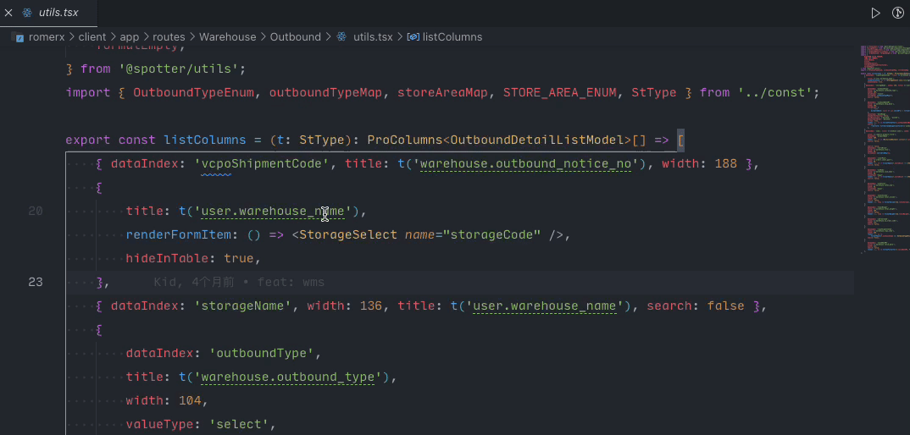

# spotter-i18n-hint

 </img>
 Spotter
 
Spotter extension to display the corresponding value of i18n key.

 
 

 
</img>

## License

[MIT](./LICENSE) License © 2023 [kitiho](https://github.com/kitiho)
